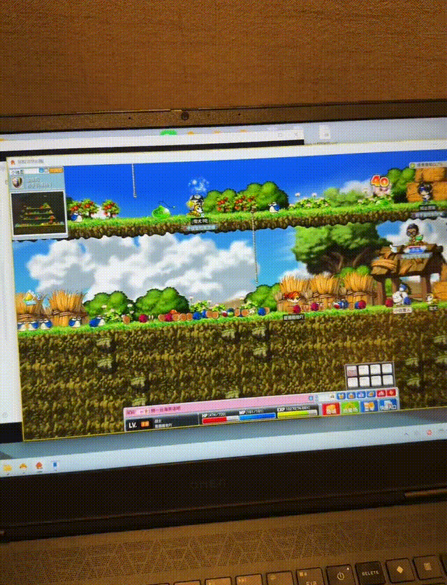
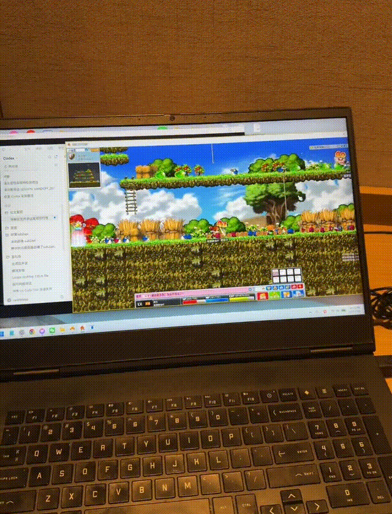
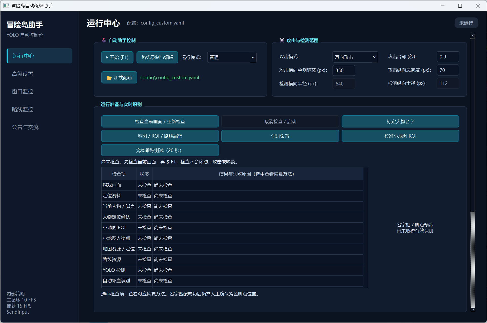

# 圈圈冒险岛助手(怀旧服测试)

这是一个基于屏幕捕获、计算机视觉和模拟键盘输入的 Windows 桌面辅助程序。

> 使用自动化程序可能违反游戏或平台规则，并可能导致账号受限或封禁。请只在获得明确许可的测试环境中使用。项目不读取游戏内存，不提供反作弊绕过，也不保证适用于任何具体服务器或客户端版本。
## 历史界面演示（录制于旧版本）





## 这个版本包含什么

- 简体中文主界面和高级设置；
- `normal`、`aux`、`patrol`、固定平台及持续攻击运行模式（仅固定平台及持续攻击运行模式测试好用）；
- ` OpenVINO `int8_head_fp` 三分类全屏检测：`monster`、`player`、`self`；
- 使用 `self` 框定位人物，寻找同层可达怪物并定向攻击；
- 小地图巡逻、路线录制、ROI 校准、血蓝监控和状态诊断；
- 保留旧双分类模型与名字样本定位流程的兼容能力。

## 环境要求

- Windows 10/11；
- Python 3.12；
- 窗口模式运行的目标程序；
- 使用键盘控制时，本程序与目标程序必须处于相同权限级别。如果目标程序以管理员身份运行，本程序也必须从管理员 PowerShell 启动。


## 安装

在项目根目录打开 PowerShell：

```powershell
py -3.12 -m venv .venv
Set-ExecutionPolicy -Scope Process Bypass
.\.venv\Scripts\Activate.ps1
python -m pip install --upgrade pip
python -m pip install -r requirements.txt
```

如果要运行测试，再安装 pytest：

```powershell
python -m pip install pytest
```

## 首次运行前必须准备的资源

仓库有意排除了所有运行素材。至少需要自行准备：

1. OpenVINO 部署包；三分类配置使用 `warrior_v3` 的 `int8_head_fp` 模型；
2. 普通路线模式使用的小地图底图和路线图；固定平台模式点击《校准小地图roi》需校准小地图并应用；

三分类模式无需名字样本。模型目录结构和输入契约见 [资源准备说明](docs/RESOURCE_SETUP.md)。未准备资源时可以打开主界面，但点击开始或按 F1 会显示缺失资源错误并拒绝启动。

## 配置

默认配置位于 `config/config_default.yaml`，保留双分类兼容设置；三分类示例位于 `config/config_classic_cn.yaml`，使用相对部署目录 `deployment/warrior_v3_openvino_int8`。请按本机游戏窗口和模型路径调整配置。


## 启动主程序

```powershell
.\.venv\Scripts\Activate.ps1
python -m src.main
```

操作方式：

- 在主界面加载三分类配置并确认模型目录、地图、攻击键和药水键；
- 点击“开始”或按 `F1` 启动；
- 再按 `F1` 暂停并释放控制键；
- `Ctrl+Shift+F12` 请求紧急关闭；
- “窗口监控”和“路线监控”用于观察识别与路线状态。

## 旧双分类模式的名字样本

先打开目标程序并显示角色，然后运行：

```powershell
python -m tools.nametagCalibrator --profile classic_cn_player --cfg classic_cn
```

按工具提示冻结画面、框选唯一名字文字并点击人物脚底。输出会写入 `nametag/classic_cn_player/`，该目录默认被 Git 忽略。

## 录制小地图与路线

```powershell
python -m tools.routeRecorder --new_map your_map_id --cfg classic_cn
```
录制器常用按键：

- `F1`：开始或暂停录制；
- `F2`：保存截图；
- `F3`：标记路线终点并保存路线；
- `F4`：保存小地图底图；
- `Q`：关闭录制器。

输出位于 `minimaps/your_map_id/`。录制完成后把 `bot.map` 设置为同一个 `your_map_id`。

## 常见错误

- `找不到部署清单`：旧双分类模型目录缺少 `manifest.json` 或配置路径错误；
- `ACTIVE_MODEL.txt 未指向三类模型`：三分类部署目录或活动模型声明不匹配；
- `缺少 profile.yaml 或 sample_*.png`：仅旧双分类模式需要名字标定；
- `Image not found: minimaps/.../map.png`：地图底图尚未录制或地图名不一致；
- `Image not found: misc/login_button_cn.png`：需要从自己的客户端画面裁剪登录按钮模板；
- 能识别但人物不移动：通常是程序权限低于目标程序，请用管理员 PowerShell 启动；
- OpenVINO 版本错误：本快照要求 Windows 环境安装 `openvino==2026.3.0`。

运行日志写入 `log/`，临时界面配置写入项目工作目录；这些内容均被 Git 忽略。

## 隐私与安全

- 游戏画面捕获和模型推理均在本机完成；

## 讨论组
QQ 群：860498805

## 打赏


## 技术支持联系群主
- 版权问题，不公开提供训练所需数据集，各位可自行标注。
- QQ群提供世界最强预训练检测模型：检测全图怪物以及玩家。
- 群主提供帮助训练yolo权重服务。


## 许可证与来源

代码按 [MIT License](LICENSE) 开源，保留原作者 Ken Yu 的版权声明。外部模型、权重、游戏素材和第三方运行时不属于本仓库授权范围，使用者必须自行确认其许可和分发权。详见 [第三方声明](THIRD_PARTY_NOTICES.md)。
